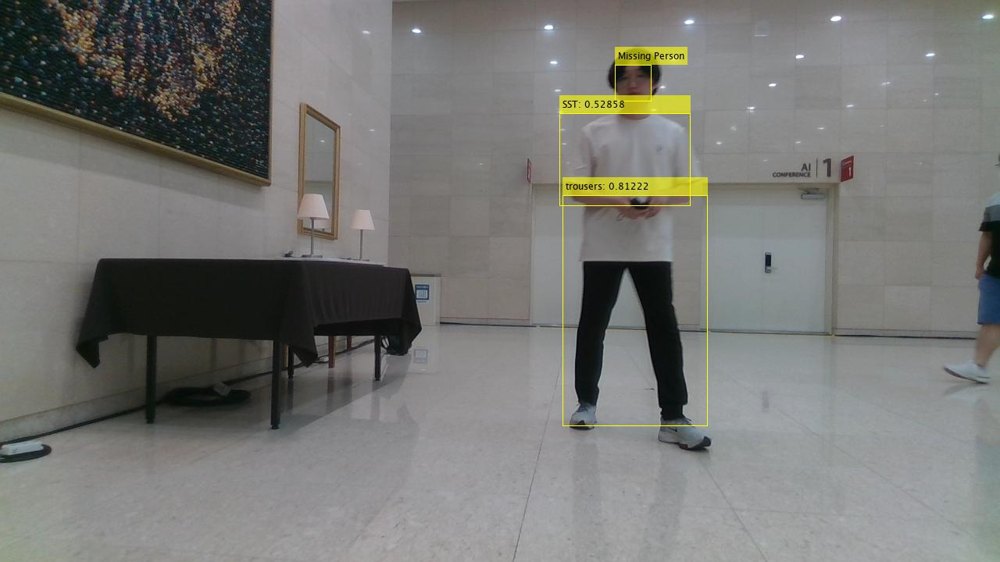

# Autonomous-Driving

# main_project

## 주요 기능

1.실종자(미아) 찾기  
* 실종자를 찾기 위한 이미지 인식 후 실종자를 찾은 후 찾았음을 전달.  
* 해당하는 사람의 뒷모습을 보고 있는 상태이면 얼굴까지 확인 할 수 있도록 설정.
* 추가적으로, 길 안내의 역할까지 구현한다면 로봇의 이동방향을 바닥에 화살표 모양의 빛으로 출력하여 어린이 또는 노인들이 이동방향을 쉽게 인지할 수 있는 기능을 넣으면 좋을 것 같다는 의견이 있음. 이 때 중요한 점은 로봇의 이동속도와 사람의 이동속도가 비슷해야 한다는 것이고 사람이 로봇의 유도에 응하지 못하거나 다른 방향으로 가는 경우, 어떤 대응을 해야할 지 고려해야 할 것으로 생각됨.  
  

2.순찰  
* 복장이 일치하지 않는 사람이 확인된 경우 해당 사람에게 다가가서 회사 혹은 단체에서 발급된 RFID 카드등을 인식 할 수 있도록 요구
* 요구에 응하지 않을 시, 경보를 발생하도록 하는 기능을 넣으면 좋을 것 같다는 의견이 있음
* 만약에 수상한 사람이면 이미 검사했던 사람도 반복적으로 검사 시행  
[PurePursuit](Pure_Pursuit.mp4)   
https://user-images.githubusercontent.com/79644050/178984304-a21c3f0e-ba40-4251-90ee-13d46810c421.mp4  

3.CCTV에서 사람이 이동한 방향등을 참고하여 미아찾기 로봇이 갈 방향에 대한 정보를 준다.
* (ex)사람이 CCTV에서 오른쪽으로 사라지는게 마지막으로 찍힘 => 로봇도 또한 그쪽으로 가도록 정보를 주어 로봇을 유도

--- 
